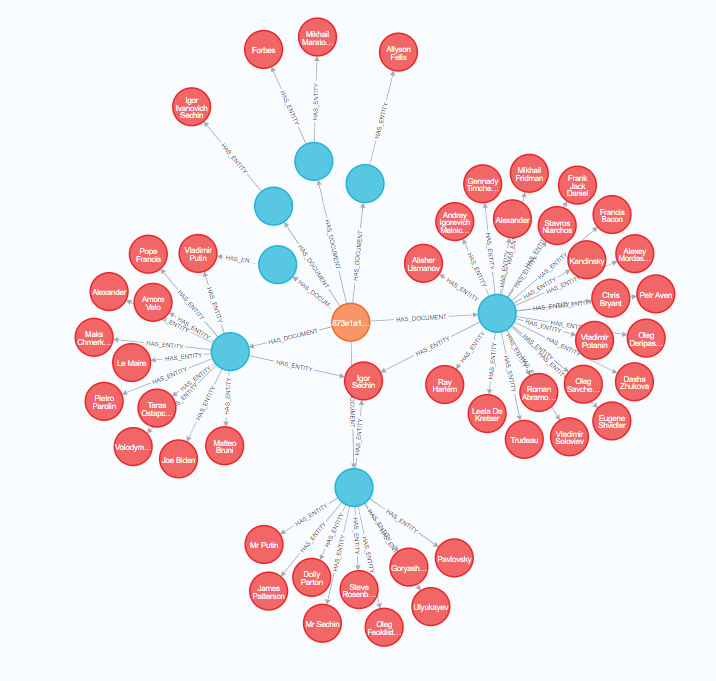
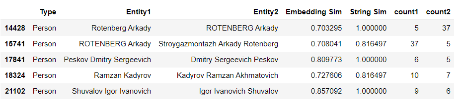

# Entities-Disambiguation

On a first step, investigations over topics where made, scraping web pages to get information about the desired topic, let's say: web pages, twitters. Applying OSINT techniques all information was saved in the DB and Solr was used to access the information.

Having this information available, we noticed in the application that there where many entities recognized by the NER that identify the same person, but there were called in a different way. To deal with this problem the entity disambiguation project was executed.

Starting from the information present in Solr we created a knowledge graph in Neo4j. The image shows an example of an investigation, it's related documents, and the persons identified in each of them. 

For the Person nodes present in the graph, the embedding of each of them was calculated and saved as new property of the node. After this, a similarity measurement was made to identify the persons that don't have the same name but represent the same person. Considering the cosine similarity between the embeddings and the similarity between the names, a threshold was defined to identify the nodes that represent the same person, as shown in the figure below. The information was saved in Solr to disambiguate the information present in the application.

